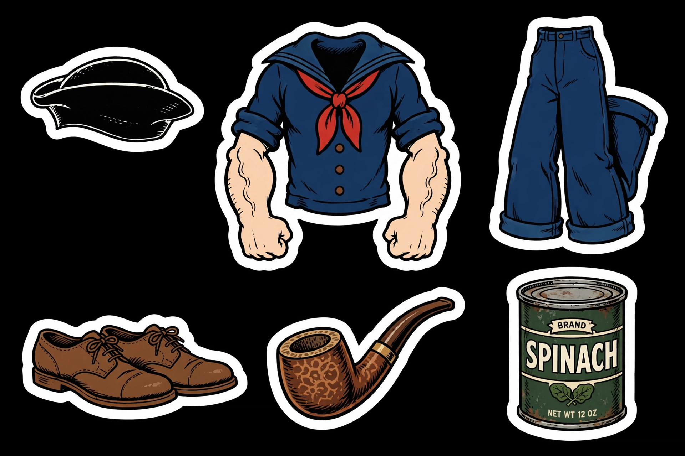
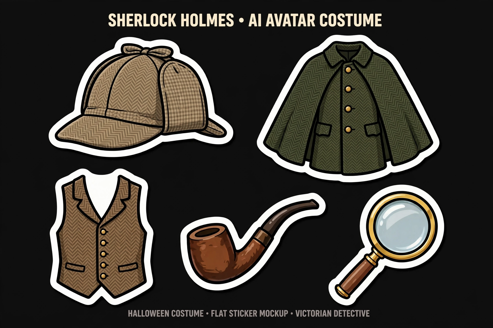
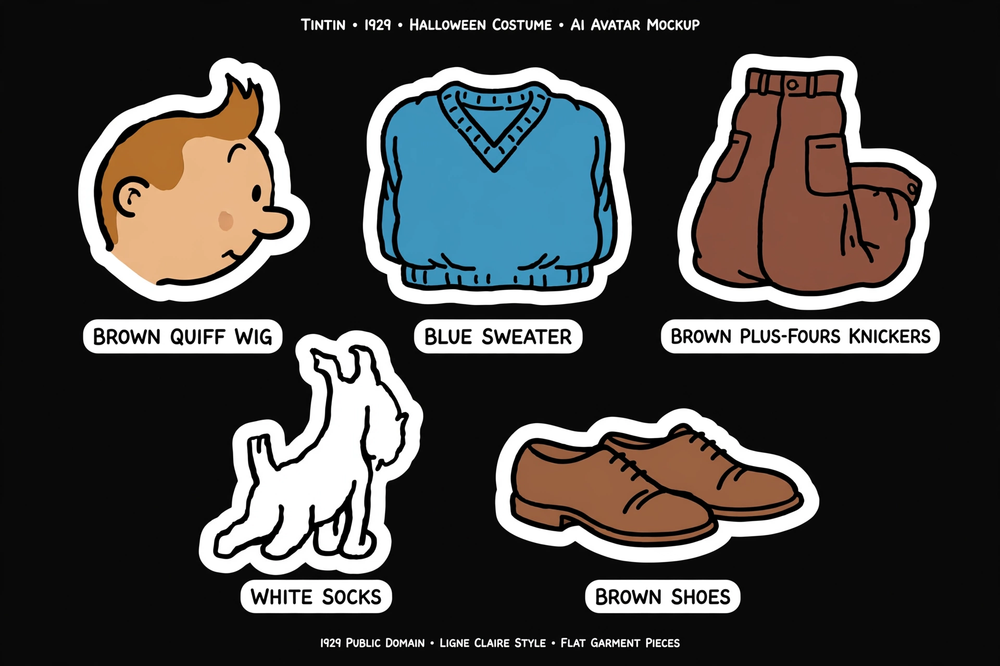
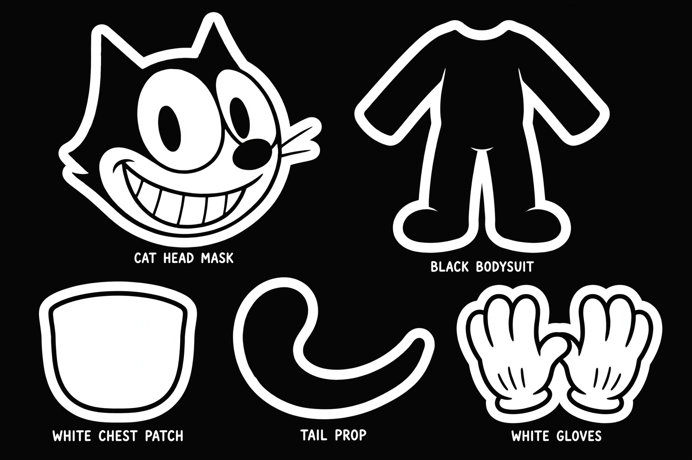
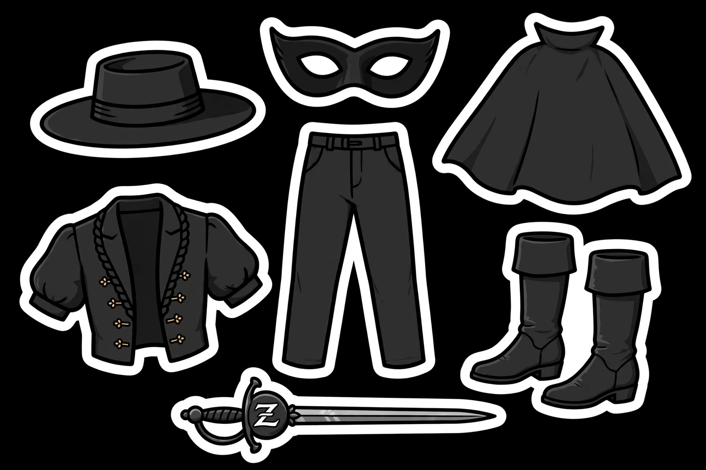
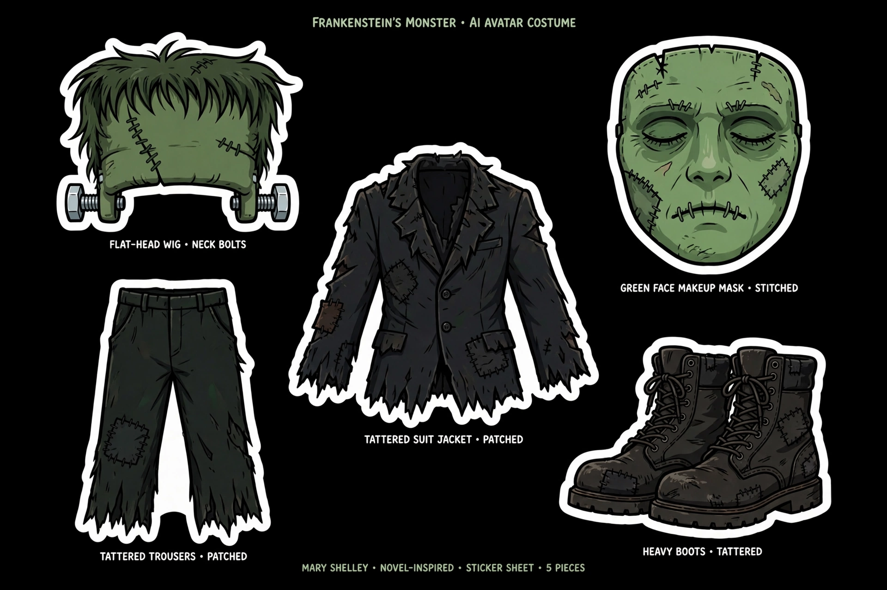

# Design Guide — Halloween 2026 Collection

How the shop's first collection was designed: the concept art, the
decisions, and the rejects. Future pack builders — this is the taste
reference.

## The process

Every costume started as a concept mockup: flat garment pieces in die-cut
sticker style (bold black outlines, white border, black background). The
mockups were judged on instant recognizability — if you can't name the
costume in two seconds, it's not a costume, it's clothes.

The three pilot packs (dracula, mummy, presidents) went further: worn
reference renders proving the costume forms onto a body, then full
SKILL.md docs. The rest below are concept-approved and waiting for the
full pack treatment per [PROTOCOL.md](PROTOCOL.md).

## The pilot three

Built to full spec — pieces, worn refs, SKILL.md:

- **Dracula** — cape with standing collar, ruffled shirt, fangs (non-negotiable),
  blood packets, medallion. Lesson: a Dracula without fangs is a guy in a cape.
- **Mummy** — irregular overlapping linen wraps (not a beige bodysuit), shroud
  over one shoulder, ankh amulet. Lesson: the wrap must read as wound, with
  visible strip edges and shadows.
- **Presidents** — Lincoln (stovepipe hat + chin-curtain beard, no mustache),
  Washington and Madison (powdered wigs). Lesson: the mask fits OVER the
  wearer's face — eyes stay visible. One president at a time.

## Concept-approved (mockups)

**Popeye** (1929 PD) — sailor cap, collar shirt, red neckerchief, corncob pipe,
spinach can. The squint is the whole character; lose it and it's a sailor.

**Sherlock Holmes** — deerstalker, Inverness cape, magnifying glass, calabash
pipe. The most instantly-readable costume in the set.

**Tintin** (1929 PD) — quiff wig, blue sweater, plus-fours. Note: the knee
socks from the original mockup were cut — they read wrong at sticker scale.

**Betty Boop** (1930 PD) — bob wig with curls, red dress, garter, hoops.
1930 Fleischer design, not the modern pin-up redraw.

**Felix the Cat** — black cat head mask with the wide grin, white chest patch,
tail. 1919 silent-era look.

**Zorro** — flat-brimmed hat, eye mask, cape, sword with Z emblem. 1919
swashbuckler.

**Frankenstein's monster** — flat-head wig with neck bolts, tattered suit.
Novel-inspired; deliberately NOT the Universal/Karloff makeup design (still
under copyright).

## Rejected

**Steamboat Willie** — mocked up, then scrapped. The 1928 design didn't read
at sticker scale and the trademark fence around the name made it more trouble
than it was worth. Lesson: public domain isn't enough — the design has to
survive the style.

## Design rules (distilled)

1. Two-second recognition test. If it fails, it's not a pack yet.
2. Die-cut sticker style until proven otherwise.
3. Novel/public-domain source for the design, never a studio's specific
   rendition (Frankenstein: Shelley, not Universal).
4. Props are pieces too — pipe, fangs, amulet all ship in `pieces/`.
5. The worn ref is where the design is proven. No worn ref, no pack.
