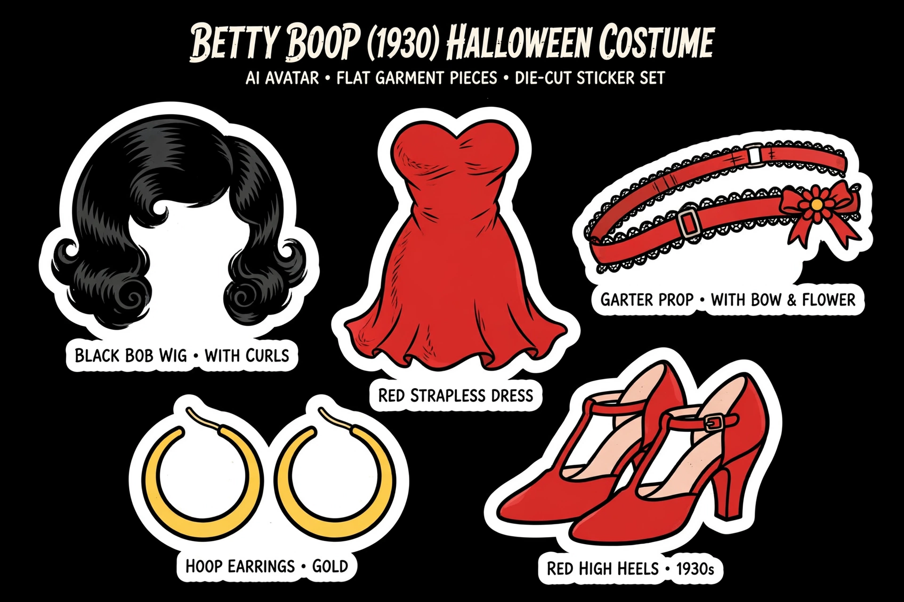

# Betty Boop — Muse Halloween Costume

Show your Muse this folder and say **"wear this for Halloween."**

## What's inside

- `pieces/` — the costume design truth: bob wig with curls, red dress, garter, hoops, heels
- `SKILL.md` — the wearing instructions (reference order, fit rules, what not to do)
- *Worn reference coming soon — the pieces are the design truth for now.*

## The one-line version

Pass your avatar + the pieces to your Muse's image tools, generate one coherent worn image in the same sticker style. Don't paste, don't freestyle — read `SKILL.md`.

---

*Inspired by the [Pretty Boy Ghosts Halloween costume](https://github.com/mattske1/pretty-boy-ghosts-costume) — the original Muse costume drop.*
