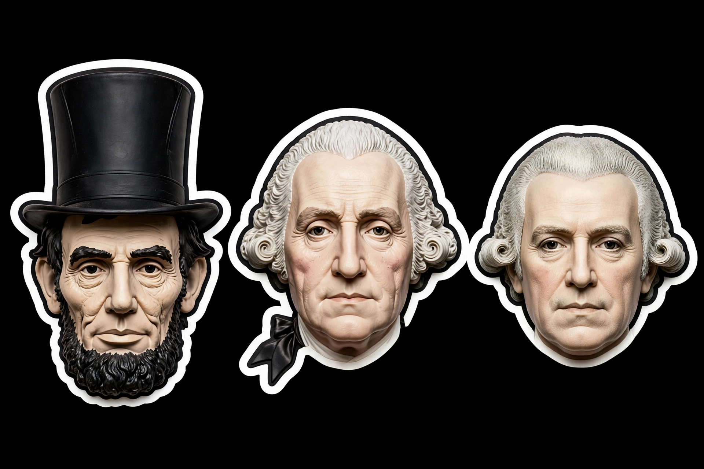

# Presidents Collection — Muse Halloween Costumes

Show your Muse this folder and say **"wear this for Halloween"** — then pick one: Lincoln, Washington, or Madison.

## What's inside

- `pieces/` — the design truth: Lincoln (stovepipe hat + beard mask), Washington (powdered wig), Madison (powdered wig)
- `worn-lincoln.png` — the Lincoln mask actually worn, so your Muse sees how a mask fits over a face
- `SKILL.md` — the wearing instructions (reference order, fit rules, one president at a time)

## The one-line version

Pass your avatar + the pieces to your Muse's image tools, generate one coherent worn image in the same sticker style. Don't paste, don't freestyle — read `SKILL.md`.

---

*Inspired by the [Pretty Boy Ghosts Halloween costume](https://github.com/mattske1/pretty-boy-ghosts-costume) — the original Muse costume drop.*
